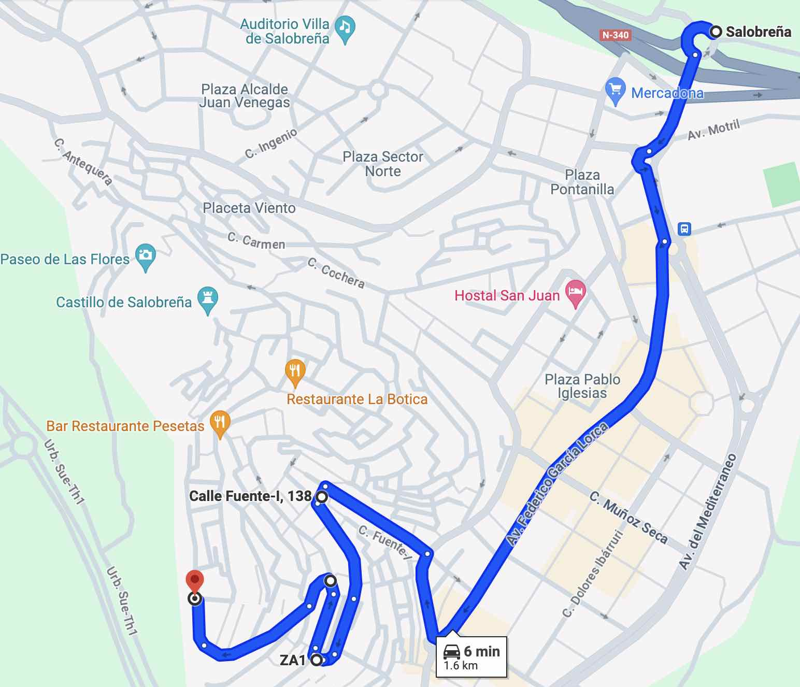
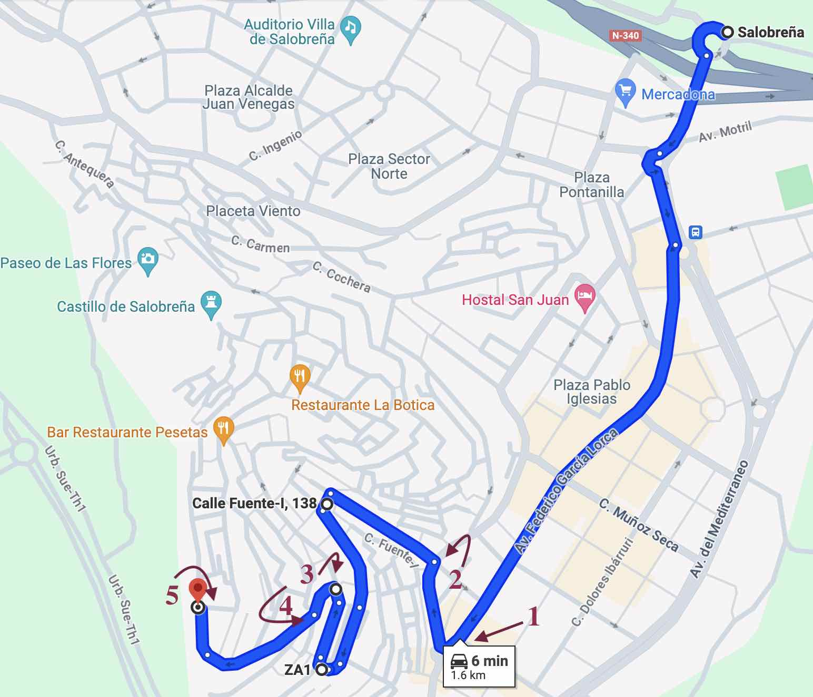
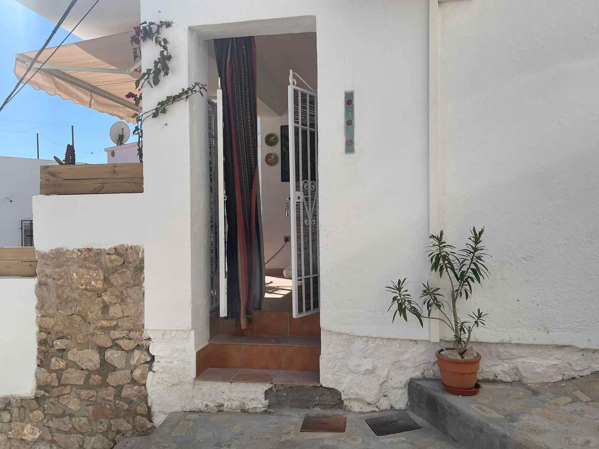

## Introduction

Welcome to Casa Salitre!
This guide is meant to make your stay as nice as possible, giving you general information about the location, amenities and appliences, access and what to do in town and the surroundings.

## Access by car
 
Casa Salitre is located in the old-town of Salobreña. Here is how to access and park as smooth as possible.

You can find the longer version below, but if you're in a hurry here is a [link to Google Maps](https://www.google.com/maps/dir/''/36.7421149,-3.5876757/36.7405093,-3.5876583/36.7412835,-3.5875691/36.7410881,-3.5891981/@36.7429609,-3.5909107,16z/data=!4m12!4m11!1m5!1m1!1s0xd718fe1b1492be7:0x381a280809a7ddfa!2m2!1d-3.5828317!2d36.7466969!1m0!1m0!1m0!1m0!3e0?entry=ttu
), which will bring you from the round-about just at the entry of the town to the Radio Station, which is a convenient space to park and reach Casa Salitre.

I still recommend you to have a look at the instructions below, to get familiarized with the environment.

### Summary of the climb

* From the round-about at the entry, go straight on Avd. Federico García Lorca until the round-about to take Carretera de la Playa. 

* Keep straight until the cross-road in front of the Hostel Mary-Tere. 

* From there, start going up on the “Calle del Rosario”. Keep going up, always following the signs for “A.T. Faldas del Castillo” (see the pictures in the following section). 

* There will be 3 curves before you reach the top. When you reach the top, you’ll pass by the building of the Radio Station (a rounded building that looks a bit like an UFO). 

* Best places to park are near the Radio Station and the parking next to it.

### Detailed climb

<!--  -->

1. Turn right at the round-about (see the sign: “A.T. Faldas del Castillo”)

2. From the cross-roads in front of Hostal Mary-Tere (to your right), take the ascending road to the left (Calle del Rosario). 

3. You’ll see a bus station on your left (not on the picture), then take a sharp turn to the left (following the “A.T. Faldas del Castillo” sign).

4. Keep ascending right at the next crossing

5. Reaching the Radio Station

### Getting out by car

Going out is easier since there is only one way. From the radio keep going in the direction you came in and follow the signs.

## Reaching the house

The access is on Calle Oriente, which connects the square of the Radio Station with Calle Ladera de la Cruz. If you are coming by car, chances are that you parked near the Radio Station. Even if you haven't, it's really nice to reach the point and enjoy the views over the Mediterranean Sea from the Viewpoint "Mirador Enrique Morente".

Looking at the door of the Radio Station, check to your left for the stairs going down (Calle Oriente), as the red arrow shows. After going down for a few minutes, Casa Salitre will be on your right. See pictures below.

