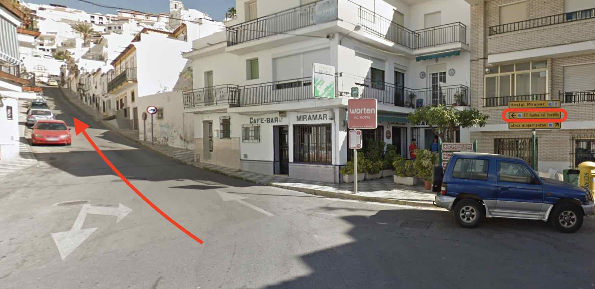
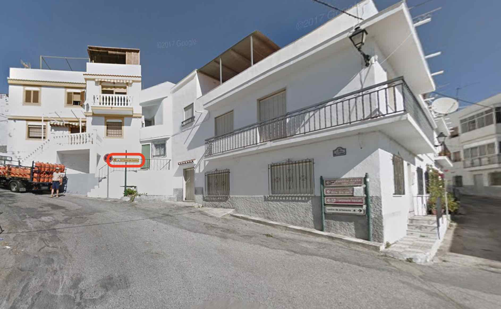
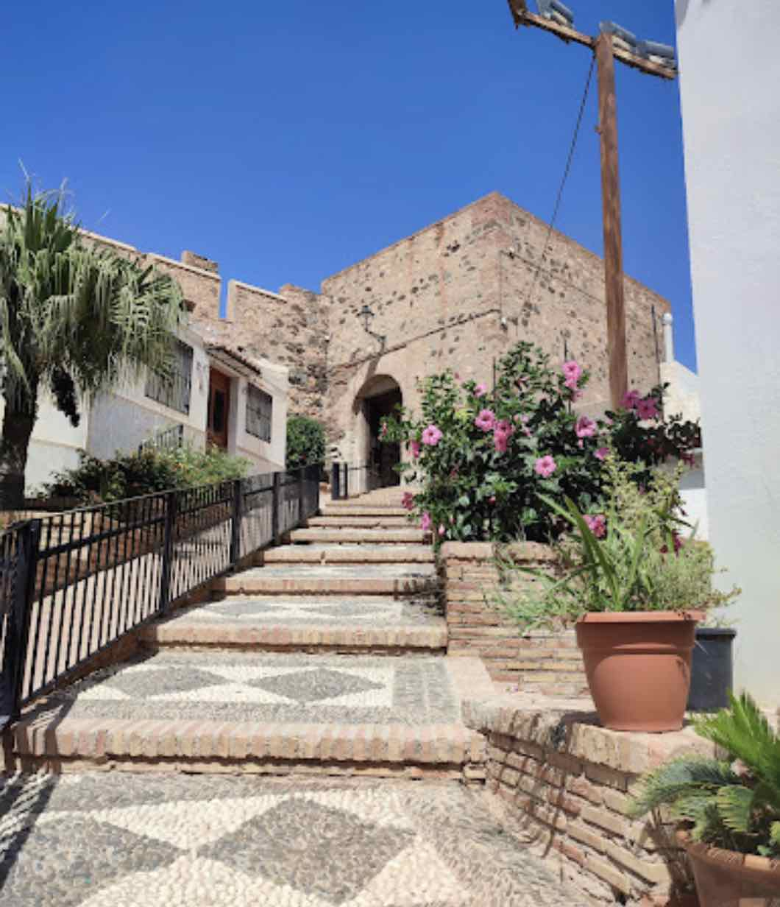

## Introduction

Welcome to Casa Salitre!
This guide is meant to make your stay as nice as possible, giving you general information about the location, amenities and appliances, access and what to do in town and the surroundings.

## Access by car
 
Casa Salitre is located in the old-town of Salobreña. Here is how to access and park as smooth as possible.

You can find the longer version below, but if you're in a hurry here is a [link to Google Maps](https://www.google.com/maps/dir/''/36.7421149,-3.5876757/36.7405093,-3.5876583/36.7412835,-3.5875691/36.7410881,-3.5891981/@36.7429609,-3.5909107,16z/data=!4m12!4m11!1m5!1m1!1s0xd718fe1b1492be7:0x381a280809a7ddfa!2m2!1d-3.5828317!2d36.7466969!1m0!1m0!1m0!1m0!3e0?entry=ttu
), which will bring you from the round-about just at the entry of the town to the Radio Station, which is a convenient space to park and reach Casa Salitre.

I still recommend you to have a look at the instructions below, to get familiarized with the environment.

### Summary of the climb

* From the round-about at the entry, go straight on Avd. Federico García Lorca until the round-about to take Carretera de la Playa. 

* Keep straight until the cross-road in front of the Hostel Mary-Tere. 

* From there, start going up on the “Calle del Rosario”. Keep going up, always following the signs for “A.T. Faldas del Castillo” (see the pictures in the following section). 

* There will be 3 curves before you reach the top. When you reach the top, you’ll pass by the building of the Radio Station (a rounded building that looks a bit like an UFO). 

* Best places to park are near the Radio Station and the parking next to it.

### Detailed climb

1. Turn right at the round-about (see the sign: “A.T. Faldas del Castillo”)

2. From the cross-roads in front of Hostal Mary-Tere (to your right), take the ascending road to the left (Calle del Rosario). 

1. You’ll see a bus station on your left (not on the picture), then take a sharp turn to the left (following the “A.T. Faldas del Castillo” sign).

1. Keep ascending right at the next crossing

5. Reaching the Radio Station

### Getting out by car

Going out is easier since there is only one way. From the radio keep going in the direction you came in and follow the signs.

## Reaching the house

The house is in the east part of the old town, in a up and coming neighborhood. The entry is on street Calle Oriente, which consists mostly of stairs.

### Access to the house
The access is on Calle Oriente, which connects the square of the Radio Station with Calle Ladera de la Cruz. If you are coming by car, chances are that you parked near the Radio Station. Even if you haven't, it's really nice to reach the point and enjoy the views over the Mediterranean Sea from the Viewpoint "Mirador Enrique Morente".

Looking at the door of the Radio Station, check to your left for the stairs going down (Calle Oriente), as the red arrow shows. After going down for a few minutes, Casa Salitre will be on your right. See pictures below.

### Check-in

Check-in is done using a safe box which you'll find on the right side when looking at the door. I'll make sure to send you the code on the day of your arrival.

## Amenities & Appliances

A quick summary of what you should find at home upon arrival.

### Bathroom

I've arranged it for hand-soap, shampoo, shower gel and conditioner, which you'll find in the bathroom. I'll make my best to ensure that they are always full.

There should be two sets of towels below the bathroom sink.

### Living room & Kitchen

Feel free to use the TV and AC. You'll find the controllers in the first drawer of the white table below the TV.

I ask you to be responsible with the usage of the AC, please always keep the doors and windows closed and switch it off at night. Thanks to its orientation and insulation, the apartment stays cool at night, even in the hottest days of summer.

There is LED light in the kitchen. The switch is to the left of the worktop when you are looking towards the kitchen.

### WIFI

The wifi name is `houdini` and the password is `escapingcat!`.

## Fun

Should you be looking for something to do or where to eat while in Salobreña, I've compiled a list of my favorites. Hope you enjoy it.

### Walking around

Everything in the old town is within walking distance. I invite you to walk around and get lost in its charming narrow streets. Everywhere is pretty safe to walk.

#### Moorish Castle
Salobreña has an [old castle](https://turismosalobrena.com/en/the-arab-castle/) that stems from moorish times. The entry is from the street [Calle Andrés Segovia](https://maps.app.goo.gl/ZVwRxnXGWZmtKePm9). It can be visited, and it's quite worthwhile (fee should be around 4E with Monday evenings being free). There are some minor archeological excavations, and you will reach the only 360° viewpoint in town!

While walking up to the castle, you'll see **Enno's workshop** on the left. Born in Germany, he's been living and portraying Salobreña's beauty for decades. You may want to check out his art.

#### Viewpoints

There are numerous **viewpoints** over the sea to the south, the "vega" to the east as well as the giant mountains to the north. Next to the house is the [viewpoint **Mirador de Enrique Morente**](https://maps.app.goo.gl/y9VAA2PV24DXrZCZ7)  dedicated to the memory of one of the most prolific and internationally known Flamenco singers ([check him on Wikipedia](https://en.wikipedia.org/wiki/Enrique_Morente)).

Following up on the street Calle Estación on the way towards the Church and the main square, you'll pass by the viewpoint [**Hoyo de la franscunda**](https://maps.app.goo.gl/kQZX2FFs9ohUmfF9A), from which you can observe the cliff below the castle and the bird population that inhabits it.

From the [main square of the old town](https://maps.app.goo.gl/ftirYyDpp57BsfmaA), right below the arcs of the old city hall, you can enjoy a view over the older parts of Salobreña's old town.

#### Beaches

For a batch in the sea, you can enjoy the entire shoreline of Salobreña. The water gets refreshed frequently with currents from the Atlantic and it's therefore a bit colder than the eastern parts of the Mediterranean. The water gets its most comfortable temperature around July and stays warm easily until the end of October. 

If you fancy more secluded beaches, do check out the [beach **Playa de la cagailla** or **Punta del río**](https://maps.app.goo.gl/3FAw7PDUxAesyfDa6) to the east (you can walk along the beach or get there by car easily), or for the more adventurous you can try the west-most part of the bay and 

If by car, you can also enjoy the astonishing beaches in the Nature Reserve past Almuñécar (about 15-20 minutes by car). These beaches are a bit out of the radar, mostly due to the difficulty to reach, since there aren't a lot of parking opportunities. In any case, I've linked them to places where's usually easy to find a parking space. The first one is [**Cantarriján**](https://maps.app.goo.gl/3FAw7PDUxAesyfDa6) (a nudist beach with dining options), which can only be accessed in high season by bus (tickets around 2E). 

Next, is [**el Cañuelo**](https://maps.app.goo.gl/Hk4UfD7zGJA1W3SP6). You'll have to walk down a bit on a dirt road until you reach its long and broad shore. Options for dining available.

Further to the west, you'll find [**Cala Pino**](https://maps.app.goo.gl/V2HEsHKAvhtRTi8K7). Parking is next to the road. From there, you have to follow down a steep path. This beach can be followed to the west over rocks, which allows you to reach **Playa Lapa**.

Finally, furthest to the west is [**Playa del Molino**](https://maps.app.goo.gl/jEEx7NjYqvLfLZWbA). This beach features a small bathtub pool filled with natural water from a spring.

#### La Caleta
[*La Caleta*](https://maps.app.goo.gl/hmB4T1uWi7poMUus5) is a nearby-town with an intriguing history. Up until the 60s and for several centuries, Salobreña's main economic activity was **sugar cane**. In order to produce sugar from it, a factory was built in the 19th century in what is now La Caleta. Soon, the factory attracted a lot of workers who started building their homes nearby and slowly the town was consolidated. The factory is still very present, and the town is totally worth visiting. There's been a recent outdoor photography exhibition "Caleteros" by local artists, which you can visit by just walking around the streets.

### Food
There's plenty to discover in the local gastronomy of Salobreña. I've listed my personal favorite places, both in and out of Salobreña. I hope you can find something to your taste.

#### Within walking distance
Despite its smaller size, Salobreña has a number of remarkable restaurants. My favorite is [**la Roka**](https://maps.app.goo.gl/1cS7G4CdWEGT41Wq5), on street Calle Estación, an award-winning restaurant with a mixture of traditional and modern cuisine and a lot of fusion. It also has an astonishing view of the sunset over the sea and a nice selection of cocktails. Often booked for weeks in advance, but make sure to try and get a spot.

More traditionally minded are [**el Pesetas**](https://maps.app.goo.gl/Dz7XN6tNvN8LCa978) and [**la Botica**](https://maps.app.goo.gl/GFz6VxFG5g3oYByb7), where you can enjoy traditional and local plates and fried fish dishes, while enjoying their roof terraces with views over the town and surroundings.

For a nice evening with food and a flamenco show, you can check [**la Traviesa**](https://maps.app.goo.gl/DHwBHqBPK1hQPRuu5). They usually have events on Monday evenings (although this may change, make sure to call, ask and book if interested).

#### At the beach

There are a lot of restaurants along the seafront promenade (commonly known as "chiringuitos") for you to choose. They often have a long menu of fish that you can usually order grilled ("a la plancha") or fried ("frito"). For a more delicate and upscale menu, you should try [**el Verdejo**](https://maps.app.goo.gl/hUTMkErPoj2dAtF49). If you are fancying a more international dinner with pizza or hamburger, you can try out [**La Bahía**](https://maps.app.goo.gl/vhUcopZkME3dp2r98).

If you are planning to visit [la Caleta](#la-caleta), you should check the grills of [**el Turrito**](https://maps.app.goo.gl/jtV7DoeMQKPvzShg7), especially if you fancy a meat cut, or [**el Puentecillo**](https://maps.app.goo.gl/BvUXRoxoQ7k58jHcA). A personal favorite for fish food at the seashore are La Guardia's [**Manolo**](https://maps.app.goo.gl/dmzNUSL322SFv9aPA) and [**Rufino**](https://maps.app.goo.gl/UE9P7s81vG1twagL9) (with a more fusion and modern options).

#### Getting out

Just out of Salobreña, there is a very nice upscale restaurant in the ground floor of the Hotel [**MIBA**](https://maps.app.goo.gl/dUUqsdHUEXSAaq6Y6). If you like cheesecake, you should definitely go and try theirs. I personally haven't tried any better cheesecake. Besides that, you'll be surprise at their delicacies and you can dine while enjoying the views over the shoreline. They also have a roof terrace to enjoy cocktails and drinks.

Finally, if you are going to visit the beaches past Almuñécar, you should try and get a reservation for dinner at 
[**Cerro Gordo**](https://maps.app.goo.gl/SaT2tBxmmimu3aAT9), perhaps the best sunset view while dining in the region.
